# GEO/AI Search Monitoring Platform - Architecture Diagrams

**Created:** December 26, 2025
**Purpose:** Comprehensive visual documentation of system architecture, workflows, and state management

---

## Table of Contents

1. [System Architecture Diagrams](#1-system-architecture-diagrams)
2. [Sequence Diagrams](#2-sequence-diagrams)
3. [Activity Diagrams](#3-activity-diagrams)
4. [State Diagrams](#4-state-diagrams)

---

## 1. System Architecture Diagrams

### 1.1 High-Level System Architecture

This diagram shows the three major pillars (Observe, Diagnose, Predict & Prove) supported by shared platform services and the AI Agent Framework.

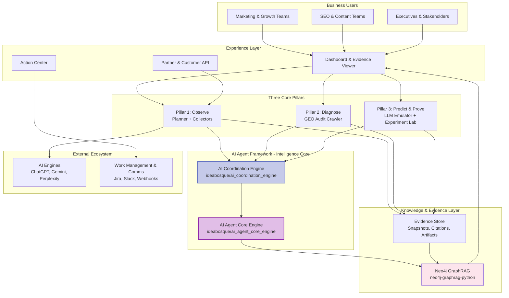

**Description:**

This business-level view emphasizes outcomes over implementation detail:

- **Who**: Marketing, SEO, and executive teams use the experience layer
- **How**: Observe -> Diagnose -> Predict & Prove
- **Intelligence**: ai_coordination_engine + ai_agent_core_engine
- **Knowledge**: Neo4j GraphRAG unifies evidence and retrieval

**Principles:** clarity, evidence traceability, and a closed improvement loop.

---

### 1.1a Three-Pillar Summary (Presentation-Friendly)

A compact diagram that highlights only the three major pillars and how they relate to each other.

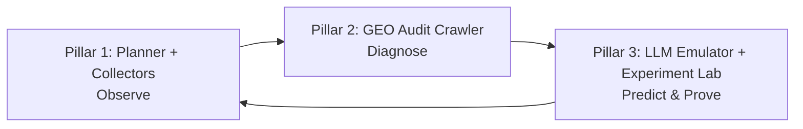

---

### 1.2 AI Agent Framework Architecture

This diagram shows the AI Agent Core Engine and Coordination Engine that power intelligent automation across the platform.

> **For complete framework documentation**, see [PLATFORM_ON_AGENT_FRAMEWORK.md](PLATFORM_ON_AGENT_FRAMEWORK.md)

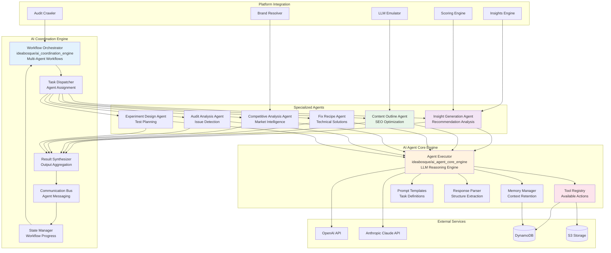

**Description:**

The AI Agent Framework is split into two engines with clear roles:

- **AI Coordination Engine** (ideabosque/ai_coordination_engine): orchestrates multi-agent workflows
- **AI Agent Core Engine** (ideabosque/ai_agent_core_engine): executes reasoning and tool calls
- **Specialized agents** plug in as configs to deliver recommendations

The framework integrates with platform services and external LLMs while keeping core logic centralized.

---

### 1.3 Data Architecture & Flow

This diagram illustrates the polyglot persistence strategy and complete data lifecycle from ingestion to archival.

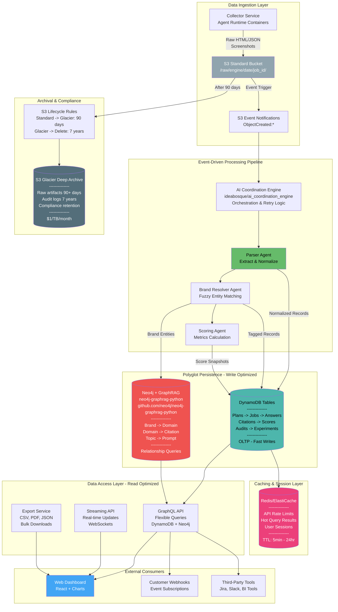

**Description:**

GraphRAG-first data flow that prioritizes evidence traceability:

- Collect -> normalize -> resolve -> score
- Persist core entities in DynamoDB and relationships/embeddings in Neo4j GraphRAG
- Access via GraphQL, Streaming, and Export

This keeps retrieval grounded in graph context while preserving operational data in DynamoDB.

| Store | Purpose | Data Examples | Access Pattern |
| --- | --- | --- | --- |
| **DynamoDB** | Transactional OLTP, fast writes/reads by key | Plans, Jobs, Answers, Citations, Scores | Get by ID, Query by index |
| **Neo4j + GraphRAG** | Graph + vector retrieval (hybrid) | Brand->Domain->Citation networks + embeddings | Graph traversal + semantic search |
| **Redis** | Hot cache, sessions, rate limiting | Query results (TTL 5-60min), user sessions | Fast key-value access |
| **S3 Standard** | Raw artifacts, unstructured data | HTML responses, screenshots, JSON | Object storage, versioned |
| **S3 Glacier** | Cold archival, compliance retention | Raw data 90+ days old, audit logs 7yr | Rare access, regulatory |

**Data Lifecycle:**

1. **Ingestion**: Collectors capture raw artifacts -> S3 Standard
2. **Event Trigger**: S3 ObjectCreated event -> Triggers AI Coordination Engine
3. **Processing**: Parser -> Brand Resolver -> Scorer (orchestrated by AI Coordination Engine)
4. **Multi-Write**: Each stage writes to appropriate database(s)
   - DynamoDB: Metadata, entities, scores
   - Neo4j + GraphRAG: Relationship edges + vector search
5. **Caching**: Hot queries cached in Redis (5min-24hr TTL)
6. **Access**: GraphQL (flexible), Streaming (real-time), Export (bulk)
7. **Archival**: S3 Lifecycle -> Glacier after 90 days -> Delete after 7 years

**Data Retention Policy:**

- **Raw Artifacts (S3)**: 90 days hot -> Glacier indefinitely
- **Screenshots**: 1 year -> Delete
- **Parsed Data (DynamoDB/Neo4j + GraphRAG)**: Indefinite retention
- **Audit Logs**: 7 years (compliance requirement)
- **Experiment Results**: Indefinite (learning repository)
- **Cache (Redis)**: 5min-24hr TTL based on data type

**Consistency Model:**

- **Eventual Consistency**: Across DynamoDB and Neo4j + GraphRAG (acceptable lag: <5 seconds)
- **Strong Consistency**: DynamoDB reads when required (e.g., billing)
- **Cache Invalidation**: Redis TTL-based + explicit invalidation on writes

---

### 1.4 Service Decomposition & Deployment Architecture

Detailed view of service deployment, scaling strategy, and inter-service communication patterns.

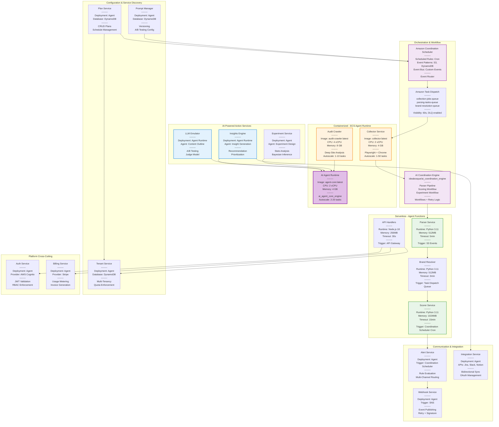

**Description:**

Services are intentionally thin and aligned to one responsibility:

- **Serverless** for bursty workflows and APIs
- **Agent Runtime** for long-running collectors and agents
- **AI Coordination Engine** for workflow control

This supports scale, cost control, and clear ownership boundaries.

| Service Class | Runtime | Scale Unit | Responsibilities |
| --- | --- | --- | --- |
| Stateless APIs | Agent | Concurrent executions (1-1000) | HTTP request handlers |
| Event Processors | Agent | Task Dispatch/S3 event triggers | Parser, Scorer, Brand Resolver |
| Heavy Compute | Agent Runtime | Task count (1-50) | Collectors (browser automation) |
| Long-Running | Agent Runtime | Task count (2-20) | AI Agent Runtime, Audit Crawler |
| Orchestration | AI Coordination Engine | Workflows | Multi-step pipelines with retry |
| Scheduling | Coordination Scheduler | Cron rules + event patterns | Daily collection, scoring jobs |

**Service Communication Patterns:**

1. **Synchronous (Request/Response)**:
   - API Gateway → Agent handlers
  - Agent → DynamoDB/Neo4j GraphRAG queries
   - Agent Runtime → OpenAI API calls

2. **Asynchronous (Event-Driven)**:
   - S3 ObjectCreated → Parser Agent
   - Task Dispatch Queue → Collector Agent Runtime tasks
   - Coordination Scheduler Cron → Scorer Agent
   - SNS Topic → Webhook Service

3. **Orchestrated (AI Coordination Engine)**:
   - Collection Pipeline: Collector → Parser → Brand Resolver → Scorer
   - Experiment Workflow: Setup → Baseline → Treatment → Analysis
   - Retry Logic: Exponential backoff for failed steps

**Service Sizing Guidelines:**

**Agent Functions:**
- **Parser**: 512MB, 5min timeout (handles large HTML)
- **Scorer**: 1024MB, 15min timeout (aggregates large datasets)
- **API Handlers**: 256MB, 30s timeout (fast response)
- **Brand Resolver**: 512MB, 3min timeout (fuzzy matching)

**Agent Runtime Tasks:**
- **Collector**: 2 vCPU, 4GB RAM (Playwright browser automation)
- **Audit Crawler**: 4 vCPU, 8GB RAM (deep site analysis, many pages)
- **AI Agent Runtime**: 2 vCPU, 4GB RAM (LLM calls, tool execution)

**Key Design Principles:**

1. **Thin Services (50-100 LOC)**: Business logic in configs, not code
2. **Single Responsibility**: Each service has one clear job
3. **Independently Deployable**: No shared code, versioned APIs
4. **Resilient**: Retry logic, DLQs, circuit breakers
5. **Observable**: Structured logs, traces, metrics per service
6. **Cost-Optimized**: Serverless scales to zero when idle

---

## 2. Sequence Diagrams

### 2.1 Daily Monitoring Flow

Complete sequence from plan creation to dashboard visualization, showing the event-driven pipeline.

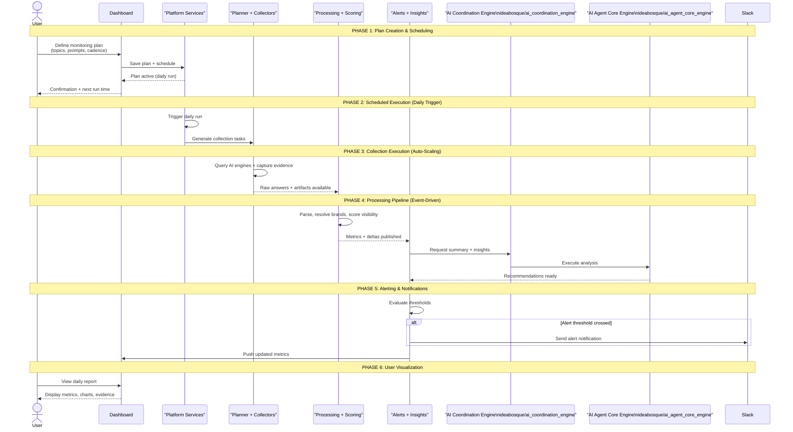

**Description:**

A concise daily loop from plan to insights:

- Define monitoring plan and schedule
- Collect AI answers and evidence
- Score visibility and publish metrics
- Notify on changes and visualize results

---

### 2.2 GEO Audit to Action Center Flow with AI Agent Orchestration

This sequence demonstrates how the AI Coordination Engine orchestrates multiple specialized agents to transform audit results into prioritized, actionable recommendations.

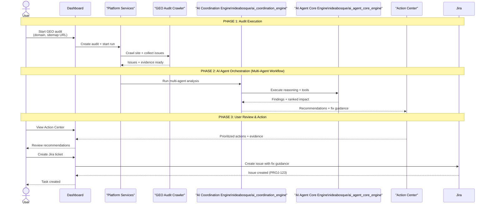

**Description:**

A product-level flow from audit to action:

- Crawl and capture issues
- Use multi-agent reasoning to diagnose and prioritize
- Deliver recommendations to the Action Center
- Create execution tasks (e.g., Jira)

---

### 2.3 LLM Emulator Testing Flow

Pre-publish content testing workflow.

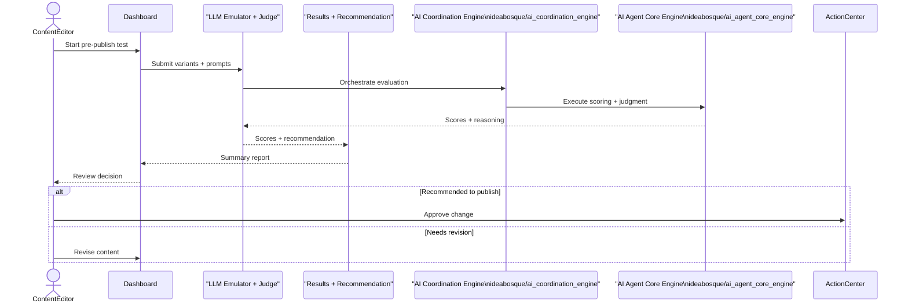

**Description:**

A pre-publish validation loop:

- Submit variants and prompts
- Emulate outcomes and judge quality
- Recommend publish or revise

---

### 2.4 Alert and Notification Flow

Real-time alerting when metrics change significantly.

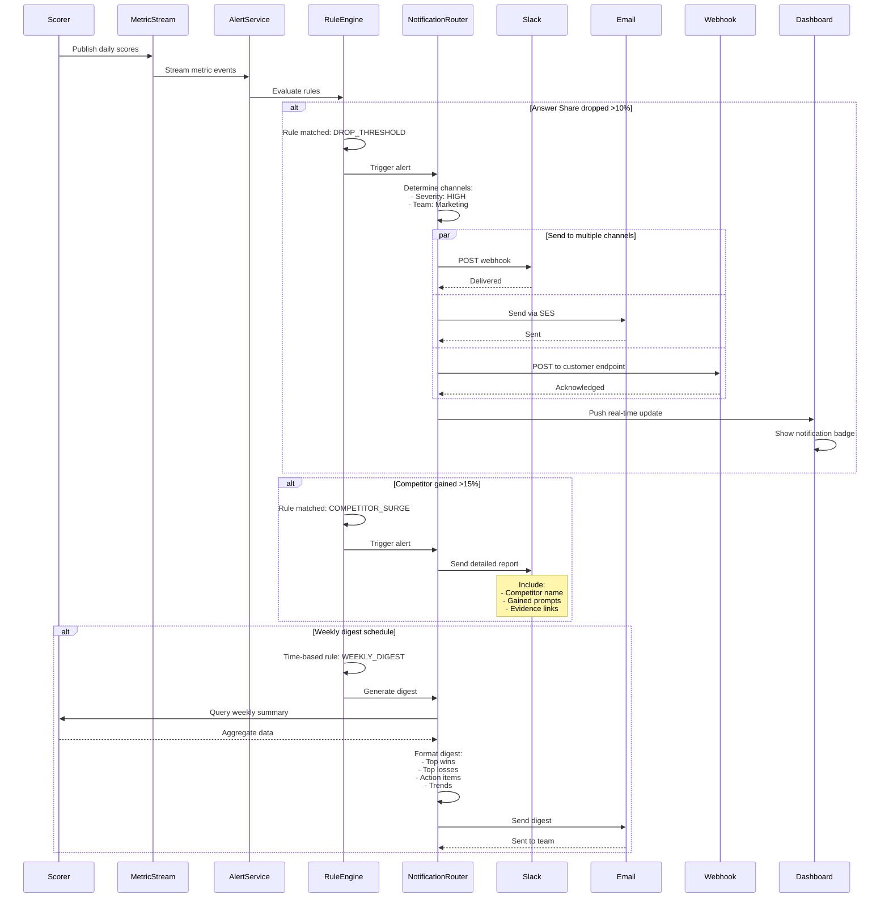

**Description:**

A simple alert lifecycle:

- Ingest metric changes
- Evaluate rules and route notifications
- Track acknowledgement and resolution

---

## 3. Activity Diagrams

### 3.1 User Journey: From Insight to Action

End-to-end user workflow from discovering an issue to implementing a fix.

```mermaid
flowchart TD
    Start([User Logs In]) --> ViewDashboard[View Dashboard]
    ViewDashboard --> CheckMetrics{Check Metrics}

    CheckMetrics -->|All Good| SetupMonitoring[Set Up New Monitoring]
    CheckMetrics -->|Issue Detected| InvestigateIssue[Investigate Issue]

    InvestigateIssue --> ViewEvidence[View Evidence:<br/>- Screenshots<br/>- Competitor Comparison<br/>- Lost Prompts]

    ViewEvidence --> RunAudit{Run GEO Audit?}

    RunAudit -->|Yes| ExecuteAudit[Execute Site Audit]
    RunAudit -->|No| CheckActionCenter[Check Action Center]

    ExecuteAudit --> ReviewIssues[Review Detected Issues]
    ReviewIssues --> CheckActionCenter

    CheckActionCenter --> PrioritizeActions[Review Prioritized Actions]
    PrioritizeActions --> SelectAction{Select Action}

    SelectAction -->|Content Fix| GenerateOutline[Generate Content Outline]
    SelectAction -->|Technical Fix| ViewFixRecipe[View Fix Recipe]
    SelectAction -->|Need More Data| RequestAnalysis[Request Deeper Analysis]

    GenerateOutline --> TestContent{Test Before Publishing?}
    ViewFixRecipe --> TestContent

    TestContent -->|Yes| RunEmulator[Run LLM Emulator]
    TestContent -->|No| CreateTask[Create Implementation Task]

    RunEmulator --> ReviewResults{Emulator Results}
    ReviewResults -->|Positive| CreateTask
    ReviewResults -->|Negative| RefineContent[Refine Content]
    RefineContent --> RunEmulator

    CreateTask --> IntegrateJira[Create Jira Ticket / Notion Task]
    IntegrateJira --> AssignTeam[Assign to Content/Dev Team]

    AssignTeam --> ImplementFix[Team Implements Fix]
    ImplementFix --> PublishChanges[Publish Changes]

    PublishChanges --> SetupExperiment{Setup Experiment?}
    SetupExperiment -->|Yes| ConfigureExperiment[Configure A/B or Pre/Post Test]
    SetupExperiment -->|No| MonitorImpact[Monitor Impact]

    ConfigureExperiment --> WaitForData[Wait for Data Collection]
    WaitForData --> AnalyzeResults[Analyze Experiment Results]

    AnalyzeResults --> MeasureImpact{Significant Lift?}
    MeasureImpact -->|Yes| DocumentSuccess[Document Success]
    MeasureImpact -->|No| RefineApproach[Refine Approach]

    DocumentSuccess --> ShareLearning[Share Learning with Team]
    MonitorImpact --> ShareLearning

    RefineApproach --> PrioritizeActions

    ShareLearning --> SetupMonitoring
    RequestAnalysis --> ViewDashboard

    SetupMonitoring --> End([Continue Monitoring])

    style Start fill:#e1f5ff
    style InvestigateIssue fill:#fff4e1
    style RunEmulator fill:#f3e5f5
    style MeasureImpact fill:#e8f5e9
    style DocumentSuccess fill:#c8e6c9
    style End fill:#e1f5ff
```

**Description:**

End-to-end user journey from signal to impact:

- Detect visibility changes
- Diagnose root cause
- Prioritize actions
- Implement and validate outcomes

---

### 3.2 Automated Collection Workflow

Detailed flow of the automated data collection process.

```mermaid
flowchart TD
    ScheduleTrigger([Coordination Scheduler Scheduled Event]) --> LoadPlans[Load Active Plans]

    LoadPlans --> CheckBudget{Within Budget?}
    CheckBudget -->|No| SendBudgetAlert[Send Budget Alert]
    CheckBudget -->|Yes| GenerateTasks[Generate Collection Tasks]

    SendBudgetAlert --> PausePlan[Pause Plan]
    PausePlan --> End1([End Run])

    GenerateTasks --> EnqueueTasks[Enqueue to Task Dispatch]
    EnqueueTasks --> DequeueTask[Dequeue Task]

    DequeueTask --> ValidateTask{Task Valid?}
    ValidateTask -->|No| SendToDLQ[Send to DLQ]
    ValidateTask -->|Yes| InitCollector[Initialize Collector]

    SendToDLQ --> AlertOps[Alert Operations Team]
    AlertOps --> End2([Manual Investigation])

    InitCollector --> SelectEngine{Select Engine}

    SelectEngine -->|ChatGPT| ConfigChatGPT[Configure ChatGPT Collector]
    SelectEngine -->|Perplexity| ConfigPerplexity[Configure Perplexity Collector]
    SelectEngine -->|Gemini| ConfigGemini[Configure Gemini Collector]

    ConfigChatGPT --> LaunchBrowser[Launch Headless Browser]
    ConfigPerplexity --> LaunchBrowser
    ConfigGemini --> LaunchBrowser

    LaunchBrowser --> NavigateToEngine[Navigate to Engine URL]
    NavigateToEngine --> WaitForLoad[Wait for Page Load]

    WaitForLoad --> InjectPrompt[Inject Prompt Text]
    InjectPrompt --> SubmitQuery[Submit Query]

    SubmitQuery --> WaitForResponse[Wait for AI Response]
    WaitForResponse --> CheckTimeout{Timeout?}

    CheckTimeout -->|Yes| RetryLogic{Retry Count < Max?}
    CheckTimeout -->|No| CaptureResponse[Capture Response]

    RetryLogic -->|Yes| IncrementRetry[Increment Retry Counter]
    RetryLogic -->|No| MarkFailed[Mark Task Failed]

    IncrementRetry --> SubmitQuery
    MarkFailed --> LogFailure[Log Failure Details]
    LogFailure --> SendToDLQ

    CaptureResponse --> ExtractAnswer[Extract Answer Text]
    ExtractAnswer --> ExtractCitations[Extract Citations]
    ExtractCitations --> TakeScreenshot[Take Screenshot]

    TakeScreenshot --> ValidateData{Data Complete?}
    ValidateData -->|No| MarkPartial[Mark Partial Success]
    ValidateData -->|Yes| PrepareArtifacts[Prepare Artifacts]

    MarkPartial --> PrepareArtifacts

    PrepareArtifacts --> UploadToS3[Upload to S3]
    UploadToS3 --> CheckUpload{Upload Success?}

    CheckUpload -->|No| RetryUpload{Retry Upload?}
    CheckUpload -->|Yes| UpdateJobStatus[Update Job Status]

    RetryUpload -->|Yes| UploadToS3
    RetryUpload -->|No| MarkFailed

    UpdateJobStatus --> PublishEvent[Publish S3 Event]
    PublishEvent --> AckMessage[Acknowledge Task Dispatch Message]

    AckMessage --> CloseBrowser[Close Browser]
    CloseBrowser --> CheckMoreTasks{More Tasks in Queue?}

    CheckMoreTasks -->|Yes| DequeueTask
    CheckMoreTasks -->|No| UpdateMetrics[Update Collection Metrics]

    UpdateMetrics --> End3([Collection Complete])

    style ScheduleTrigger fill:#e1f5ff
    style CheckBudget fill:#fff9c4
    style ValidateTask fill:#fff9c4
    style CheckTimeout fill:#ffccbc
    style CheckUpload fill:#fff9c4
    style End3 fill:#c8e6c9
```

**Description:**

Automated collection pipeline at a glance:

- Schedule runs
- Collect AI answers
- Store evidence and compute scores
- Surface insights to users

---

### 3.3 Experiment Workflow

Complete workflow for running and analyzing experiments.

```mermaid
flowchart TD
    Start([User Initiates Experiment]) --> DefineGoal[Define Experiment Goal]

    DefineGoal --> SelectType{Select Experiment Type}

    SelectType -->|A/B Test| SetupAB[Setup A/B Test]
    SelectType -->|Pre/Post| SetupPrePost[Setup Pre/Post Test]

    SetupAB --> DefineVariants[Define Variant Groups:<br/>Control A and Treatment B]
    SetupPrePost --> DefineBaseline[Define Baseline Period]

    DefineVariants --> SelectPages[Select Test Pages]
    DefineBaseline --> SelectPages

    SelectPages --> SelectPrompts[Select Target Prompts]
    SelectPrompts --> SetDuration[Set Test Duration]

    SetDuration --> SetMetrics[Define Success Metrics:<br/>- Primary: Answer Share<br/>- Secondary: Citation Share, Prominence]

    SetMetrics --> CalculateSampleSize[Calculate Required Sample Size]
    CalculateSampleSize --> ReviewPlan[Review Experiment Plan]

    ReviewPlan --> ApproveTest{Approve?}
    ApproveTest -->|No| ModifyPlan[Modify Parameters]
    ApproveTest -->|Yes| StartBaseline[Start Baseline Collection]

    ModifyPlan --> ReviewPlan

    StartBaseline --> CollectBaselineData[Collect Baseline Data]
    CollectBaselineData --> CheckBaseline{Baseline Complete?}

    CheckBaseline -->|No| CollectBaselineData
    CheckBaseline -->|Yes| ImplementChanges[Implement Changes]

    ImplementChanges --> DeployVariant{Deploy Variant}

    DeployVariant -->|A/B| RandomizeTraffic[Randomize Traffic:<br/>50% A, 50% B]
    DeployVariant -->|Pre/Post| DeployToAll[Deploy to All Pages]

    RandomizeTraffic --> StartTreatment[Start Treatment Collection]
    DeployToAll --> StartTreatment

    StartTreatment --> MonitorProgress[Monitor Daily Progress]
    MonitorProgress --> CheckSampleSize{Sufficient Sample?}

    CheckSampleSize -->|No| ContinueCollection[Continue Data Collection]
    CheckSampleSize -->|Yes| CheckDuration{Min Duration Met?}

    ContinueCollection --> MonitorProgress

    CheckDuration -->|No| ContinueCollection
    CheckDuration -->|Yes| FinalizeData[Finalize Data Collection]

    FinalizeData --> CleanData[Clean & Validate Data]
    CleanData --> RunAnalysis[Run Statistical Analysis]

    RunAnalysis --> CalculateMetrics[Calculate:<br/>- Mean Difference<br/>- Confidence Interval<br/>- P-value]

    CalculateMetrics --> BayesianAnalysis[Bayesian Uplift Modeling]
    BayesianAnalysis --> CheckSignificance{Statistically Significant?}

    CheckSignificance -->|No| AnalyzeVariance[Analyze Variance:<br/>- Insufficient data<br/>- No real effect<br/>- High variance]
    CheckSignificance -->|Yes| CalculateUplift[Calculate Uplift %]

    AnalyzeVariance --> InterpretResults[Interpret Results]
    CalculateUplift --> InterpretResults

    InterpretResults --> GenerateReport[Generate Experiment Report]

    GenerateReport --> IncludeEvidence[Include Evidence:<br/>- Screenshots<br/>- Answer Comparisons<br/>- Citation Changes]

    IncludeEvidence --> PublishResults[Publish Results to Dashboard]
    PublishResults --> NotifyStakeholders[Notify Stakeholders]

    NotifyStakeholders --> ReviewByTeam{Team Review}

    ReviewByTeam -->|Success| RolloutWinner{Rollout Winner?}
    ReviewByTeam -->|Failure| DocumentLearning[Document Learning]
    ReviewByTeam -->|Inconclusive| ExtendTest[Extend Test Duration]

    ExtendTest --> MonitorProgress

    RolloutWinner -->|Yes| FullDeployment[Deploy to All Pages]
    RolloutWinner -->|No| RevertChanges[Revert Changes]

    FullDeployment --> UpdateBestPractices[Update Best Practices]
    DocumentLearning --> UpdateBestPractices
    RevertChanges --> DocumentLearning

    UpdateBestPractices --> ArchiveExperiment[Archive Experiment]
    ArchiveExperiment --> End([Experiment Complete])

    style Start fill:#e1f5ff
    style ApproveTest fill:#fff9c4
    style CheckSignificance fill:#fff9c4
    style ReviewByTeam fill:#fff9c4
    style End fill:#c8e6c9
```

**Description:**

Scientific validation flow:

- Define hypothesis and setup
- Run baseline and treatment
- Analyze results and decide rollout

---

## 4. State Diagrams

### 4.1 Collection Job State Machine

State transitions for individual collection jobs.

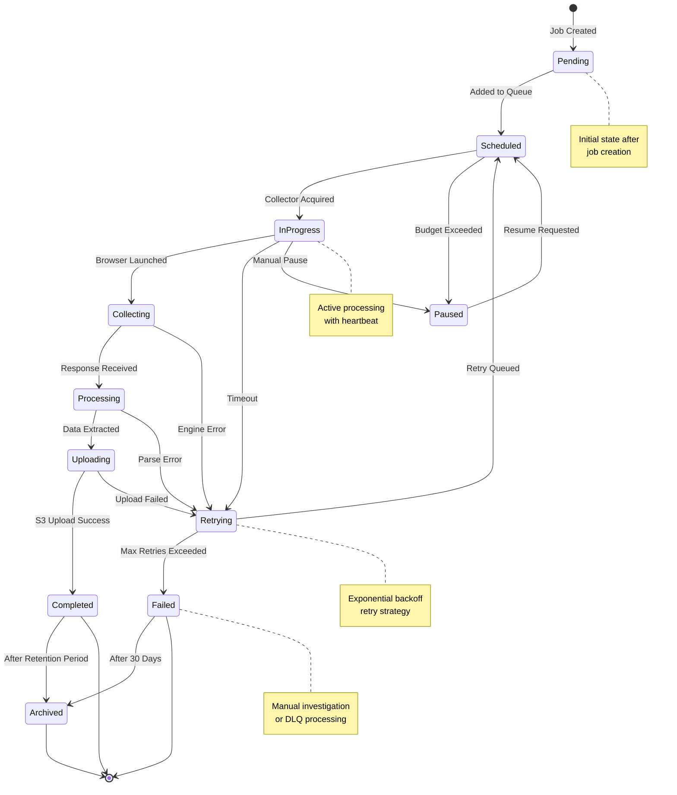

**Description:**

Job lifecycle for monitoring tasks:

- Pending -> Running -> Completed
- Retry and pause paths for failures or budget limits
- Archived when retention ends

---

### 4.2 Audit Issue Lifecycle

State machine for GEO audit issues.

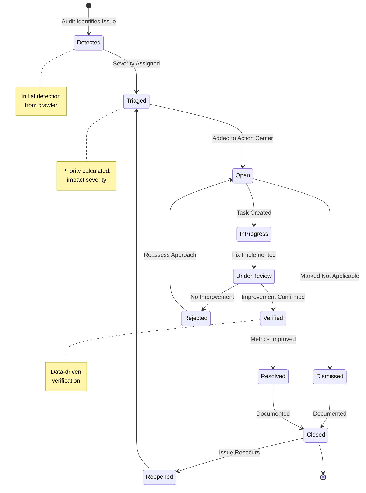

**Description:**

Issue lifecycle from detection to closure:

- Detect -> Triage -> Work -> Verify -> Close
- Reopen if issues recur

---

### 4.3 Experiment State Machine

State transitions for experiment lifecycle.

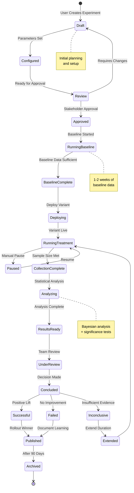

**Description:**

Experiment lifecycle from draft to archive:

- Draft -> Review -> Run -> Analyze -> Publish
- Archive for long-term learning

---

### 4.4 Alert State Machine

Lifecycle of alert notifications.

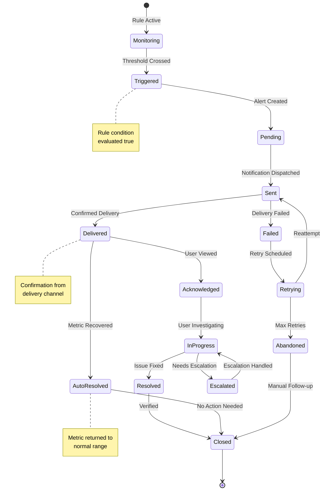

**Description:**

Alert lifecycle with recovery paths:

- Monitor -> Trigger -> Notify
- Acknowledge -> Resolve or Auto-resolve
- Retry and escalation when delivery fails

---

## Summary

These diagrams provide comprehensive visual documentation of the GEO/AI Search Monitoring Platform:

**Architecture Diagrams** show the structural organization of components, data flow patterns, and technology stack choices.

**Sequence Diagrams** illustrate detailed interactions between components over time, showing how specific workflows are executed.

**Activity Diagrams** map user journeys and business processes, showing decision points and parallel activities.

**State Diagrams** define lifecycle management for key entities, ensuring consistent state transitions and proper error handling.

Together, these diagrams serve as:
- **Communication tools** for stakeholders
- **Implementation guides** for developers
- **Training materials** for new team members
- **Documentation** for system maintenance
- **Planning artifacts** for future enhancements

---

**Last Updated:** December 26, 2025
**Maintained By:** Platform Architecture Team
