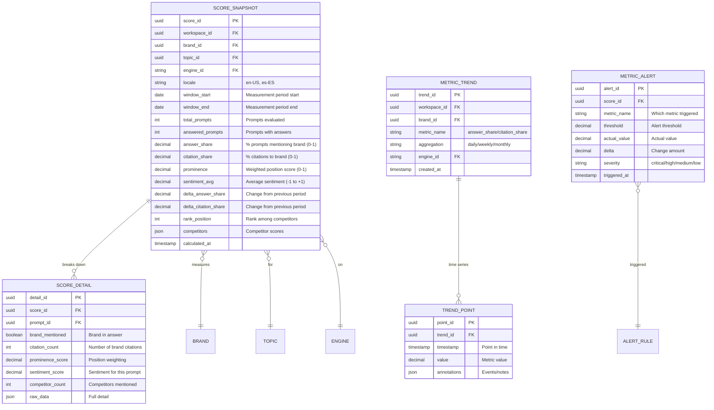

# GEO/AI Search Monitoring Platform - Entity-Relationship Diagrams

**Created:** December 26, 2025
**Purpose:** Comprehensive data model and database schema documentation

**GraphRAG Alignment:** Entity relationships are designed to support Neo4j GraphRAG retrieval, with core entities and their links optimized for graph traversal and embedding-aware queries.

---

## Table of Contents

1. [Complete ER Diagram](#1-complete-er-diagram)
2. [Core Domain Entities](#2-core-domain-entities)
3. [Monitoring & Collection Entities](#3-monitoring--collection-entities)
4. [Analysis & Scoring Entities](#4-analysis--scoring-entities)
5. [Action & Optimization Entities](#5-action--optimization-entities)
6. [AI Agent Framework Entities](#6-ai-agent-framework-entities)
7. [Platform & Governance Entities](#7-platform--governance-entities)
8. [Detailed Entity Specifications](#8-detailed-entity-specifications)

---

## 1. Complete ER Diagram

### 1.1 High-Level Entity Relationships


**Description:**

This comprehensive ER diagram shows all major entities and their relationships in the platform. Key relationship types:

- **One-to-Many (||--o{)**: A workspace has many topics, a topic has many prompts
- **Many-to-One (}o--)**: Many citations belong to one domain
- **One-to-One (||--||)**: A collection job produces exactly one raw artifact (primary), which becomes one answer record
- **Many-to-Many**: Implemented through junction tables (e.g., Query Plan to Prompts)

---

## 2. Core Domain Entities

### 2.1 Workspace and User Management


**Key Relationships:**
- **Workspace → Users**: One workspace contains many users (multi-user collaboration)
- **User → Workspace**: Each user belongs to exactly one workspace (single-tenancy per user)
- **Workspace → Roles**: Custom roles for fine-grained permissions
- **API Keys**: Programmatic access tied to workspace
- **Audit Logs**: Complete activity tracking for compliance

**Data Integrity Rules:**
- User email must be unique within workspace
- Workspace owner cannot be deleted
- At least one admin must exist per workspace
- API keys auto-expire if not used for 90 days

---

### 2.2 Topic and Prompt Structure


**Key Features:**
- **Topic Hierarchy**: Organize prompts by business vertical or theme
- **Prompt Versioning**: Track changes over time for historical analysis
- **Multi-language Support**: Same prompt in multiple locales
- **Intent Classification**: Understand query purpose (info vs. transaction)
- **Variants**: Test different phrasings of same question

**Example Data:**
```json
{
  "topic": {
    "name": "Herbal Supplements",
    "description": "Products and suppliers in herbal supplement industry",
    "category": "Nutrition",
    "metadata": {"industry": "Healthcare", "competition_level": "high"}
  },
  "prompts": [
    {
      "text": "Who are the best suppliers of ashwagandha extract?",
      "locale": "en-US",
      "intent": "informational",
      "variants": [
        "Where can I find quality ashwagandha suppliers?",
        "Top ashwagandha extract manufacturers"
      ],
      "priority": "high"
    }
  ]
}
```

---

## 3. Monitoring & Collection Entities

### 3.1 Query Plans and Scheduling


**Query Plan Logic:**
- Plans are reusable configurations for monitoring
- Each plan can monitor multiple prompts across multiple engines
- Schedules support cron expressions for flexible timing
- Budget caps prevent runaway costs
- Plans can be paused/resumed without losing configuration

**Budget Cap Example:**
```json
{
  "budget_cap": {
    "runs_per_day": 800,
    "max_monthly_cost": 500,
    "alert_threshold": 0.8,
    "auto_pause_on_exceed": true
  }
}
```

---

### 3.2 Collection Jobs and Artifacts


**Artifact Types:**
1. **HTML**: Raw page source from AI engine
2. **JSON**: Structured API responses
3. **PNG**: Screenshots for evidence
4. **Metadata**: Job configuration, timestamps, engine version

**Lifecycle:**
1. Job created and scheduled
2. Collector picks up job
3. Queries AI engine
4. Captures response + screenshot
5. Uploads to S3
6. Creates artifact records
7. Triggers parsing pipeline

**Retention Policy:**
- Raw artifacts: 90 days in standard storage
- After 90 days: Move to Glacier
- Screenshots: 1 year retention
- Parsed data: Indefinite in DynamoDB/Neo4j + GraphRAG

---

## 4. Analysis & Scoring Entities

### 4.1 Answer Records and Citations


**Answer Record Details:**
- **Full Text**: Complete AI-generated response
- **Structure Analysis**: Identifies lists, paragraphs, sections
- **Confidence**: Some engines provide confidence scores
- **Metadata**: Engine version, model name, response time

**Citation Tracking:**
- **Position**: 1st citation has highest value
- **Context**: Text around the citation for relevance
- **First-party vs Third-party**: Critical for brand visibility

**Entity Recognition:**
- Extract all brand/product mentions from answer
- Calculate prominence based on position and frequency
- Link to known brands in database

**Sentiment Analysis:**
- Positive: Brand endorsed, recommended, praised
- Neutral: Factual mention without opinion
- Negative: Criticism, warning, alternatives suggested

---

### 4.2 Scoring and Metrics



**Scoring Calculations:**

**Answer Share:**
```
answer_share = (prompts_with_brand_mention / total_prompts_answered)
```

**Citation Share:**
```
citation_share = (brand_citations / total_citations_in_answers)
```

**Prominence:**
```
prominence = Σ(position_weight × mention_quality) / total_mentions
where position_weight = 1/position (1st = 1.0, 2nd = 0.5, 3rd = 0.33, ...)
```

**Sentiment:**
```
sentiment_avg = Σ(sentiment_score × mention_count) / total_mentions
Range: -1 (very negative) to +1 (very positive)
```

**Competitor Comparison:**
```json
{
  "competitors": [
    {"brand": "Competitor A", "answer_share": 0.52, "rank": 1},
    {"brand": "Your Brand", "answer_share": 0.42, "rank": 2},
    {"brand": "Competitor B", "answer_share": 0.35, "rank": 3}
  ]
}
```

---

## 5. Action & Optimization Entities

### 5.1 GEO Audit and Issues


**Issue Codes:**
- `FAQ_SCHEMA_MISSING`: No FAQ structured data
- `PRODUCT_SCHEMA_INCOMPLETE`: Missing product fields
- `META_TITLE_WEAK`: Title tag not optimized
- `META_DESCRIPTION_MISSING`: No meta description
- `CONTENT_THIN`: Insufficient content depth
- `SPEED_SLOW`: Page load >3 seconds
- `MOBILE_UNFRIENDLY`: Mobile UX issues
- `BROKEN_LINKS`: Dead links on page
- `DUPLICATE_CONTENT`: Canonical issues

**Priority Calculation:**
```
priority_score = (
    (impacted_prompts × 10) +
    (competitor_advantage × 20) +
    (expected_lift × 50) +
    (severity_weight × 20)
) / 100

Where:
- impacted_prompts: Number of prompts affected
- competitor_advantage: How much competitors benefit (0-1)
- expected_lift: Predicted improvement (0-1)
- severity_weight: critical=1.0, high=0.7, medium=0.4, low=0.1
```

**Fix Recipe Example:**
```json
{
  "issue_code": "FAQ_SCHEMA_MISSING",
  "fix_recipe": {
    "type": "structured_data",
    "schema": "FAQPage",
    "steps": [
      "Identify common questions from prompt data",
      "Write clear, concise answers",
      "Add FAQPage schema.org markup",
      "Test with Google Rich Results Test"
    ],
    "code_example": "<script type=\"application/ld+json\">...</script>",
    "estimated_time": "2-4 hours",
    "difficulty": "medium"
  }
}
```

---

### 5.2 Action Items and Integrations


**Supported Integrations:**
1. **Jira**: Create issues, sync status, attach evidence
2. **Notion**: Create pages in databases, update properties
3. **Asana**: Create tasks, update progress
4. **Linear**: Create issues with labels
5. **Slack**: Post to channels, thread discussions
6. **Custom Webhooks**: JSON payload to any endpoint

**Integration Workflow:**
1. User selects recommendation
2. Platform generates action item
3. Integration creates task in external system
4. Bidirectional sync keeps status updated
5. Comments flow between systems
6. Completion triggers verification

---

## 6. AI Agent Framework Entities

> **For complete framework documentation**, see [PLATFORM_ON_AGENT_FRAMEWORK.md](PLATFORM_ON_AGENT_FRAMEWORK.md)

### 6.1 Agent Configuration and Execution

This section is intentionally brief. Agent configuration and execution are managed by the two foundation modules:
- https://github.com/ideabosque/ai_agent_core_engine
- https://github.com/ideabosque/ai_coordination_engine

For schema details and runtime semantics, refer to those repositories and the platform framework documentation.

### 6.2 Agent Learning and Optimization


**Description:**

This lightweight schema captures learning signals for the coordination layer:
- https://github.com/ideabosque/ai_coordination_engine

It keeps feedback and metrics at the workflow level so orchestration can improve without exposing internal agent step detail.


## 7. Platform & Governance Entities

### 7.1 Experiments and Testing


**Experiment Types:**

1. **A/B Test**:
   - Simultaneous comparison
   - Traffic split 50/50 (or custom)
   - Randomized assignment

2. **Pre/Post**:
   - Before measurement (baseline)
   - Deploy change
   - After measurement (treatment)
   - Compare periods

3. **Multivariate**:
   - Test multiple variables simultaneously
   - Factorial design
   - Identify interactions

**Sample Size Calculation:**
```
n = (Z_α/2 + Z_β)² × 2σ² / δ²

Where:
- Z_α/2: Z-score for significance level (1.96 for 95%)
- Z_β: Z-score for power (0.84 for 80% power)
- σ: Standard deviation of metric
- δ: Minimum detectable effect
```

**Statistical Analysis:**
```json
{
  "primary_metric": "answer_share",
  "control": {
    "mean": 0.32,
    "std": 0.08,
    "n": 120
  },
  "treatment": {
    "mean": 0.47,
    "std": 0.09,
    "n": 120
  },
  "results": {
    "difference": 0.15,
    "relative_lift": 0.47,
    "p_value": 0.003,
    "confidence_interval": [0.06, 0.24],
    "cohens_d": 1.79,
    "statistically_significant": true,
    "recommendation": "Deploy treatment variant"
  }
}
```

---

### 7.2 Alerts and Notifications


**Alert Rule Examples:**

**Critical Drop:**
```json
{
  "name": "Critical Answer Share Drop",
  "metric": "answer_share",
  "condition": "drop",
  "threshold": 0.10,
  "window_minutes": 1440,
  "severity": "critical",
  "filters": {
    "engines": ["chatgpt", "perplexity"],
    "topics": ["herbal_ingredients"]
  },
  "actions": {
    "notify": ["slack", "email", "sms"],
    "create_task": true,
    "escalate_after_hours": 2
  }
}
```

**Competitor Surge:**
```json
{
  "name": "Competitor Gain Alert",
  "metric": "competitor_answer_share",
  "condition": "spike",
  "threshold": 0.15,
  "severity": "high",
  "actions": {
    "notify": ["slack"],
    "attach_evidence": true,
    "suggested_actions": true
  }
}
```

---

### 7.3 Billing and Usage


**Pricing Tiers:**

**Free:**
- 1 user
- 1 monitoring plan
- 100 runs/month
- Email support
- $0/month

**Professional:**
- 5 users
- Unlimited plans
- 2,000 runs/month
- All AI engines
- Priority support
- $299/month

**Enterprise:**
- Unlimited users
- Unlimited plans
- Custom run limits
- Dedicated support
- SLA guarantee
- Custom pricing

**Overage Billing:**
```
runs_over_quota = runs_used - runs_quota
overage_cost = runs_over_quota × overage_rate

Example:
Quota: 2,000 runs
Used: 2,450 runs
Rate: $0.10/run
Overage: 450 × $0.10 = $45
```

---

## 8. Detailed Entity Specifications

### 8.1 Indexes and Constraints

**Primary Indexes:**
```sql
-- High-traffic query patterns
CREATE INDEX idx_answer_records_prompt_engine
  ON answer_records(prompt_id, engine_id, captured_at DESC);

CREATE INDEX idx_citations_domain_date
  ON citations(domain_id, created_at DESC);

CREATE INDEX idx_scores_brand_topic_date
  ON score_snapshots(brand_id, topic_id, window_start DESC);

CREATE INDEX idx_jobs_status_scheduled
  ON collection_jobs(status, scheduled_at);

CREATE INDEX idx_alerts_workspace_status
  ON alerts(workspace_id, status, triggered_at DESC);
```

**Unique Constraints:**
```sql
-- Prevent duplicates
ALTER TABLE users
  ADD CONSTRAINT unique_email_per_workspace
  UNIQUE (workspace_id, email);

ALTER TABLE domains
  ADD CONSTRAINT unique_domain_name
  UNIQUE (domain_name);

ALTER TABLE prompts
  ADD CONSTRAINT unique_text_per_topic_locale
  UNIQUE (topic_id, text, locale);
```

**Foreign Key Constraints:**
```sql
-- Referential integrity
ALTER TABLE answer_records
  ADD CONSTRAINT fk_job
  FOREIGN KEY (job_id) REFERENCES collection_jobs(job_id)
  ON DELETE CASCADE;

ALTER TABLE citations
  ADD CONSTRAINT fk_answer
  FOREIGN KEY (answer_id) REFERENCES answer_records(answer_id)
  ON DELETE CASCADE;

ALTER TABLE score_snapshots
  ADD CONSTRAINT fk_brand
  FOREIGN KEY (brand_id) REFERENCES brands(brand_id)
  ON DELETE RESTRICT;
```

---

### 8.2 Data Retention Policies

**Retention Rules by Entity:**

| Entity | Retention | Archival Strategy |
|--------|-----------|-------------------|
| RAW_ARTIFACT | 90 days hot, then Glacier | S3 lifecycle policy |
| ANSWER_RECORD | Indefinite | Indexed in Neo4j + GraphRAG |
| SCORE_SNAPSHOT | Indefinite | Aggregated over time |
| COLLECTION_JOB | 1 year | Archive to cold storage |
| AUDIT_LOG | 7 years | Compliance requirement |
| ALERT | 1 year | Summarized for reporting |
| EXPERIMENT_RESULT | Indefinite | Learning repository |

**Purge Policies:**
```sql
-- Delete old job logs
DELETE FROM job_logs
WHERE created_at < NOW() - INTERVAL '90 days';

-- Archive old alerts
INSERT INTO alerts_archive
SELECT * FROM alerts
WHERE triggered_at < NOW() - INTERVAL '1 year';

DELETE FROM alerts
WHERE triggered_at < NOW() - INTERVAL '1 year';
```

---

### 8.3 Data Volume Estimates

**Typical Workspace (Professional Tier):**

| Entity | Daily Records | Monthly Total | Storage/Record | Monthly Storage |
|--------|--------------|---------------|----------------|-----------------|
| COLLECTION_JOB | 2,000 | 60,000 | 2 KB | 120 MB |
| RAW_ARTIFACT | 2,000 | 60,000 | 50 KB | 3 GB |
| ANSWER_RECORD | 2,000 | 60,000 | 5 KB | 300 MB |
| CITATION | 10,000 | 300,000 | 500 B | 150 MB |
| SCORE_SNAPSHOT | 100 | 3,000 | 2 KB | 6 MB |
| AUDIT_ISSUE | 50 | 1,500 | 3 KB | 4.5 MB |
| **TOTAL** | | | | **~3.6 GB/month** |

**Scaling Projections:**

- **100 Workspaces**: ~360 GB/month
- **1,000 Workspaces**: ~3.6 TB/month
- **10,000 Workspaces**: ~36 TB/month

---

## Summary

This ER diagram documentation provides a complete data model for the GEO/AI Search Monitoring Platform:

1. **Complete ER Diagram**: Shows all entities and relationships
2. **Core Domain**: Workspace, users, topics, prompts, brands
3. **Monitoring**: Query plans, collection jobs, artifacts
4. **Analysis**: Answer records, citations, scoring
5. **Action**: Audits, recommendations, action items
6. **Platform**: Experiments, alerts, billing

**Key Design Principles:**
- **Normalization**: Minimize redundancy
- **Foreign Keys**: Maintain referential integrity
- **Indexes**: Optimize query performance
- **Retention**: Balance cost and compliance
- **Scalability**: Support multi-tenancy efficiently

---

**Last Updated:** December 26, 2025
**Maintained By:** Data Architecture Team
