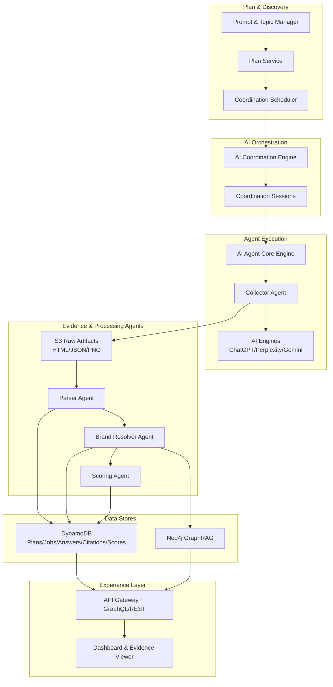

# Pillar 1 Development Plan: Planner + Collectors (Observe)

**Last Updated:** December 26, 2025

This document consolidates Pillar 1 requirements and implementation details from:
- `docs/HIGH_LEVEL_DEVELOPMENT_PLAN.md`
- `docs/PLATFORM_ON_AGENT_FRAMEWORK.md`
- `docs/ARCHITECTURE_DIAGRAMS.md`
- `docs/ER_DIAGRAMS.md`
- `docs/_pdf_text/2430d902-8057-4f0b-8551-f81d072a519b__GEOAI_Search_Monitoring_Platform_Comprehensive_Development_Plan.txt`
- `docs/_pdf_text/b15cbcc1-dbe7-4410-a9fe-1222e924c672__GEOAI_Search_Monitoring_Platform_Development_Plan.txt`
- `docs/_pdf_text/0371b396-b092-4867-8e5a-3b1f2d73de1c_GEOAI_Search_Monitoring__Optimization_Platform.txt`
- `docs/_pdf_text/bf849806-315b-4047-a7fe-1e116a50ec5c_GEOAI_Search_Monitoring_platform.txt`
- `docs/_pdf_text/151c6b14-43be-45bf-b177-77749936303e_GEOAI_Analytics_Platform.txt`
- `docs/_pdf_text/3f86e0ea-4c0a-490c-98bc-13ba1d000609_GEOAI_Search_Monitoring_Platform_-_Business_Journey_Diagram.txt`

---

## 1) Scope and Objectives

**Business goal:** Establish visibility into how AI search engines describe and cite the brand versus competitors.

**Core capabilities:**
- **Discover & Plan:** Prompt and topic management, cadence, budget, engine/locale targeting.
- **Monitor & Understand:** Automated collection from AI engines, evidence capture, parsing/normalization.
- **Analytics & Scoring:** Answer share, citation share, prominence, sentiment, deltas.

**Out of scope:** GEO audit crawler, LLM emulator, experiment lab (Pillars 2 and 3).

---

## 1.1 Pillar 1 Breakdown (Parts)

**Part A: Discover & Plan**
- Define topics, prompts, engines, locales, cadence, and budgets.
- Output: active plans and schedules that drive collection jobs.

**Part B: Monitor & Understand**
- Collect answers and evidence from AI engines.
- Normalize responses and resolve brands/competitors.
- Output: structured answers, citations, and evidence.

**Part C: Analytics & Scoring**
- Compute Answer Share, Citation Share, Prominence, Sentiment, and deltas.
- Output: score snapshots and trends surfaced in dashboards.

---

## 2) Architecture Summary

**Key services:**
- **Orchestration:** AI Coordination Engine (coordinations, tasks, schedules, sessions).
- **Execution:** AI Agent Core Engine (config-driven agents for collection + normalization).
- **Processing:** Agent tools for parsing, brand resolution, and scoring.
- **Storage:** S3 for raw artifacts, DynamoDB for structured data, Neo4j GraphRAG for relationships.
- **Access:** GraphQL/REST API + React/Next.js dashboard.

**Data flow (high-level):**
1. Plans -> Coordination tasks + schedules
2. Coordination sessions -> agent execution
3. Collection agents -> S3 raw artifacts
4. Parser + resolver agents -> normalized entities
5. Scoring agents -> snapshots
6. Dashboard -> KPIs + evidence

**Coordination model (from AI Coordination Engine):**
- **Coordination** defines the blueprint for a workflow.
- **Task** defines what should run; **TaskSchedule** defines when.
- **Session** is a runtime instance that tracks state and runs agents.

### 2.1 Pillar 1 Architecture Diagram

---

## 3) Data Model (Pillar 1)

**Planning:**
- `topics`, `prompts`, `plans`
- `plan_prompt`, `plan_engine`, `plan_schedule`

**Collection & evidence:**
- `collection_job`, `raw_artifact`, `job_log`, `artifact_version`

**Normalized data:**
- `answer_record`, `citation`

**Competitive mapping:**
- `brands`, `brand_aliases`, `domain`

**Metrics:**
- `score_snapshot`

**References:** `docs/ER_DIAGRAMS.md` sections 2-4.

### 3.1 Pillar 1 ER Diagram (Focused)

---

## 4) Pillar 1 Workflow

1. **Plan creation**: Users define topics, prompts, engines, locales, cadence, and budget.
2. **Scheduling**: AI Coordination Engine creates tasks and sessions.
3. **Collection**: Collector agents query AI engines and capture answer + citations + screenshots.
4. **Parsing**: Parser agents normalize outputs into `answer_record` + `citation`.
5. **Brand resolution**: Alias/domain matching tags first-party vs competitor.
6. **Scoring**: Nightly batch job computes shares, prominence, sentiment, and deltas.
7. **Dashboard**: KPIs, evidence viewer, and comparisons.

### 4.0 Data Hierarchy Diagram (Pillar 1)

### 4.0.1 Data Hierarchy (Analytics View)

### 4.0.2 Data Hierarchy (Storage View)

### 4.1 Collection Sequence Diagram

### 4.2 Collection Activity Diagram

### 4.3 Collection Job State Diagram

### 4.4 Plan Creation Activity Diagram

### 4.5 Part A Sequence Diagram (Discover & Plan)

### 4.6 Part B Sequence Diagram (Monitor & Understand)

### 4.7 Part C Sequence Diagram (Analytics & Scoring)

---

## 5) Phase Roadmap

### Phase 1 (Months 1-3): Planner + Collectors MVP

**Infrastructure & DevOps**
- AWS CDK/Terraform baseline (S3, DynamoDB, IAM, KMS, API Gateway).
- CI/CD with GitHub Actions + CloudWatch observability.

**Prompt & Topic Manager**
- CRUD for `topics`, `prompts`, `plans`.
- Configure cadence, budgets, engines, locales, and competitor tracking.
- API endpoints: `/plans`, `/prompts`, `/topics`.
- React UI for creation and management.
  - **Plan creation flow (user):**
    - Create topic (business vertical) and add prompts.
    - Select target engines, locales, and competitors.
    - Set cadence (daily/weekly/monthly) and budget caps.
    - Review and activate the plan.
  - **Plan creation tasks (technical):**
    - Validate inputs (prompt uniqueness per topic/locale, cadence schema).
    - Persist `topics`, `prompts`, `plans`, `plan_prompt`, `plan_engine`, `plan_schedule`.
    - Create a versioned plan snapshot for audit/history.
    - Emit a plan-activated event for scheduling.

**Orchestration**
- AI Coordination Engine schedules tasks and instantiates sessions.
- Budget guardrails and plan pause on exceed.
  - **Plan creation flow (user):**
    - Choose schedule type (cron/interval) and timezone.
    - Save schedule and confirm next run time.
  - **Plan creation tasks (technical):**
    - Create Task + TaskSchedule for the plan.
    - Instantiate Sessions (prompt x engine x locale).
    - Persist `collection_job` records with `scheduled_at`.
    - Enforce budget caps before scheduling; auto-pause on exceed.

**Collectors**
- Collector agents for ChatGPT + Perplexity.
- Evidence capture (HTML, JSON, screenshots) to S3 `/raw/{engine}/{date}`.
- Retries, rate limiting, proxy rotation.
  - **Plan creation flow (user):**
    - Confirm which engines run per plan and set run limits.
    - Optionally enable manual re-run for specific prompts.
  - **Plan creation tasks (technical):**
    - Store engine-specific collector config in `plan_engine.config`.
    - Seed sessions with tasks derived from the plan schedule.
    - Track per-plan run quotas and enforce per-engine rate limits.

**Parser & Normalizer**
- Parser agent on artifact arrival.
- Extract answer text + citations + metadata.
- Store normalized records in DynamoDB.
  - **Plan creation flow (user):**
    - No direct user action; implied by plan activation.
  - **Plan creation tasks (technical):**
    - Ensure parsing pipeline is registered for plan-specific S3 prefixes.
    - Validate normalized schema alignment per engine.

**Dashboard MVP**
- Answer share, citation share, evidence viewer.
- Basic filters and prompt explorer.
  - **Plan creation flow (user):**
    - Select plan to view; filter by engine, locale, or topic.
  - **Plan creation tasks (technical):**
    - Index prompt/plan metadata for fast filtering.
    - Ensure evidence links map to plan/job IDs.

**Success metrics**
- Collector success rate >97%
- Data freshness <60 minutes
- Dashboard load time <1.5s
- Prompt coverage 90%

---

### Phase 2 (Months 4-6): Competitive + Scoring Depth

**Brand & Competitor Resolver**
- `brands`, `brand_aliases`, `domain` tables.
- Fuzzy matching and domain parsing.
- Neo4j GraphRAG edges: Brand -> Domain -> Topic -> Citation.

**Scoring & Trends**
- Agent-driven batch aggregations to `score_snapshot`.
- Metrics: answer share, citation share, prominence, sentiment, deltas.
- Store snapshots for time-series queries.

**Dashboard v2**
- Competitor share graphs and multi-engine comparisons.
- Drill-down filters by engine, topic, locale, timeframe.

**Success metrics**
- Competitor coverage 90%+
- Weekly engagement >70%
- Action adoption tracking enabled

---

## 6) APIs (Pillar 1)

**Planning**
- `POST /plans`
- `POST /prompts`
- `POST /topics`
- `GET /plans/:id`

**Data access**
- `GET /answers`
- `GET /citations`
- `GET /scores`

**Evidence**
- Signed S3 URLs for screenshots and raw artifacts.

---

## 7) Operational Requirements

**Reliability**
- 99.9% dashboard availability
- >97% successful runs/day

**Performance**
- p95 query <1.5s
- Ingestion to dashboard <60 minutes

**Cost control**
- Per-workspace budgets and quotas
- Queue backpressure
- Auto-pause on budget exceed

**Security**
- KMS at rest, TLS in transit
- IAM least-privilege
- Signed evidence URLs

**Retention**
- Raw artifacts: 90 days hot -> Glacier
- Screenshots: 1 year retention
- Parsed data: indefinite

---

## 8) Risks and Mitigations

**Collector fragility**
- Engine UI changes can break scraping.
- Mitigation: per-engine adapter versioning + canary runs.

**Anti-bot and captcha**
- Mitigation: proxy rotation, human-like pacing, retry and fallback paths.

**Cost spikes**
- Mitigation: budget caps, run quotas, auto-pause, per-engine cost estimates.

**Data drift**
- Mitigation: schema validation in parser, QA sampling, alert on parse errors.

---

## 9) Deliverables Checklist

- Planner + collectors MVP (plans -> jobs -> answers -> dashboard)
- Engine connectors for 2 engines (ChatGPT + Perplexity)
- Parser + normalization pipeline
- Evidence capture (HTML/JSON/PNG)
- Brand resolver + scoring engine
- Dashboard v1 + v2 analytics
- APIs for plans and data retrieval
- Observability dashboards (success rate, latency, cost/run)

---

## 10) KPIs (Pillar 1)

- Collector success rate: >97%
- Data freshness: <60 minutes
- Dashboard load time: <1.5s
- Prompt coverage: 90%
- Competitor coverage: 90%+ (Phase 2)
- Weekly engagement: >70%
